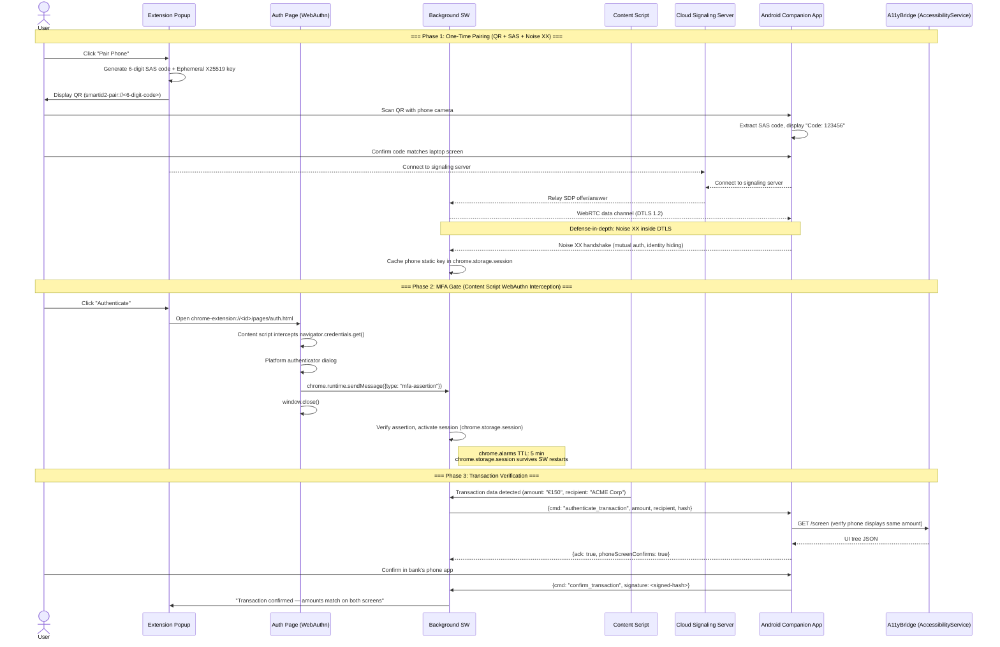

# SmartID2: Browser Extension → Android Phone QRLJacking Mitigation

## Comprehensive Implementation Plan with Phishing-Resistant MFA & Secure Channel

**Status:** Plan (v2 — remediated from 3 architectural critiques) | **Date:** 2026-05-01 | **Version:** 2.0

---

## 0. Root Architecture Decisions

_These 6 decisions resolve the 5 meta-problems identified across all architectural critiques. Every subsequent section inherits from these decisions._

| # | Decision | Rationale |
|---|----------|-----------|
| **D1** | **Use Case: Banking QRLJacking Mitigation** — not generic phone control | Command set: `authenticate_transaction`, `confirm_amount`, `reject_transaction`, `read_screen`, `ping`. No `/click` automation. Aligns with SmartID ecosystem (IDEA.md §8). Reduces attack surface. |
| **D2** | **Connection Model: WebRTC Data Channel with cloud signaling** | Extension cannot listen on ports (Chrome constraint). WebRTC requires no listener on either side. ICE auto-discovers LAN path. QR contains only a 6-digit SAS code — NOT IP:port. Signaling server (free Socket.io/Firebase tier) sees only opaque SDP blobs. |
| **D3** | **WebAuthn: Content script interception on extension's own `chrome-extension://` origin** — NOT popup, NOT Dedicated Tab, NOT third-party RP domain | The plan's own research (`webauthn-passkey-research.md` §3, W3C issue #1158) states extensions must intercept page-level WebAuthn. Content script injects into the extension's auth page (`web_accessible_resources`). RP ID is `chrome-extension://<id>` with fixed extension ID in `wxt.config.ts`. **This is the FenkoHQ/passkey-vault pattern — the only proven approach.** |
| **D4** | **Session State: `chrome.storage.session`** — RAM-only, survives SW restarts | MV3 service workers terminate after ~30s inactivity. In-memory state is destroyed. `chrome.storage.session` provides RAM-based persistence that survives cold-starts within the same browser session. |
| **D5** | **Crypto: Noise XX for first pairing, IK for reconnection** | XX provides mutual identity hiding (no pre-knowledge of peer key). IK leaks identity on every connection — acceptable ONLY for reconnection where keys are already cached. **Noise runs INSIDE WebRTC DTLS as defense-in-depth, not redundant.** |
| **D6** | **Android: On-demand activation via FCM wake, 60s transient service** | Persistent foreground service + notification = user uninstalls within a day. OnePlus/Samsung kill it anyway. FCM push wakes the app on-demand. Service stays alive 60 seconds after last command, then `stopSelf()`. |

**Resolved contradictions from previous plan version:**
- ~~Noise over WebSocket~~ → Noise over WebRTC Data Channel (eliminates CSP ws:// problem)
- ~~HMAC session token~~ → Removed (Noise AEAD already authenticates every message)
- ~~Popup / Dedicated Tab WebAuthn~~ → Content script interception on extension origin
- ~~`@chainsafe/noise`~~ → `@noble/curves` + `@noble/ciphers` + `@noble/hashes`
- ~~Phone-as-server with listening WebSocket~~ → WebRTC P2P with cloud signaling
- ~~Foreground service + persistent notification~~ → FCM wake + transient 60s service
- ~~`ws://localhost:*` CSP wildcard~~ → `connect-src` for signaling server only
- ~~8-day timeline~~ → ~25-day timeline with verification gates
- ~~NanoHTTPD Android WebSocket~~ → `org.webrtc:google-webrtc` + `lazysodium-java`

---

## Table of Contents

1. [High-Level Architectural Overview](#1-high-level-architectural-overview)
2. [Communication Protocol Selection](#2-communication-protocol-selection)
3. [Step-by-Step Implementation Phases](#3-step-by-step-implementation-phases)
4. [Immediate Next Steps (Priority Order)](#4-immediate-next-steps-priority-order)
5. [STRIDE Threat Model](#5-stride-threat-model)
6. [References to Research Directory](#6-references-to-research-directory)

---

## 1. High-Level Architectural Overview

### 1.1 System Context

The system connects a Chrome browser extension on a laptop to an Android phone (OnePlus) on the same WiFi/Bluetooth network. The extension detects when the browser is on a whitelisted domain (e.g., `lhv.ee`), reads page content, authenticates the user via phishing-resistant MFA, and transmits control commands to the phone's Accessibility Service.

### 1.2 Component Architecture (Mermaid Sequence)



### 1.3 Security Boundaries

```
┌──────────────────── Security Boundary: "Laptop" ────────────────────────────┐
│                                                                              │
│  Extension Popup (chrome-extension://)                                       │
│  • React 19 + Zustand (backed by chrome.storage.session)                     │
│  • Pairing (QR + SAS), Transaction verification display                       │
│                                                                              │
│  Extension Auth Page (chrome-extension://<id>/pages/auth.html)                │
│  • navigator.credentials.create/get (content script interception)            │
│  • Portaled from browser's core WebAuthn RP context                           │
│                                                                              │
│  Background Service Worker                                                    │
│  • WebRTC peer (via offscreen document)                                       │
│  • Noise XX/IK session manager                                                │
│  • chrome.storage.session (survives SW restarts)                             │
│  • chrome.alarms (TTL enforcement across restarts)                            │
│                                                                              │
└──────────────────────────────────────────────────────────────────────────────┘
                                 │
            WebRTC Data Channel (DTLS 1.2 + SCTP)
            └─ Noise XX/IK inside (defense-in-depth)
                                 │
┌─────────────────── Security Boundary: "Android Phone" ──────────────────────┐
│                                                                              │
│  Companion App (on-demand, FCM-activated, 60s lifetime)                      │
│  • WebRTC client (Google WebRTC library)                                     │
│  • Noise XX/IK (lazysodium-java / libsodium)                                 │
│  • FCM push receiver for wake-up                                             │
│  • Transaction display UI                                                     │
│                                                                              │
│  Accessibility Layer                                                          │
│  ├─ Primary: A11yBridge APK (localhost:7333)                                 │
│  └─ Fallback: Direct AccessibilityService in companion app                   │
│                                                                              │
└──────────────────────────────────────────────────────────────────────────────┘
```

### 1.4 Key Design Decisions (Grounded in Research)

| Decision | Selected | Reference |
|----------|----------|-----------|
| Use case | Banking QRLJacking mitigation (limited command set) | D1; `docs/research/webauthn-browser-extension-implementation-plan.md` |
| Connection model | WebRTC Data Channel with cloud signaling (NOT phone-as-server) | D2; `research/gemini-secure-channel.md` §1 row 1 |
| Transport | DTLS 1.2 (mandatory in WebRTC) + Noise XX/IK inside (defense-in-depth) | D2, D5; `research/secure-channel-options.md` §4 |
| Pairing bootstrap | QR with 6-digit SAS code (Numeric Comparison model) | §1.3 (Phase 1); `research/gemini-secure-channel-advanced.md` §2 |
| Noise pattern | XX (first pair, identity hiding) + IK (reconnect, cached keys) | D5; both from Noise Protocol Framework spec |
| MFA mechanism | WebAuthn via content script interception on `chrome-extension://` auth page | D3; `webauthn-passkey-research.md` §5, FenkoHQ/passkey-vault |
| Session management | `chrome.storage.session` + `chrome.alarms` TTL (NOT in-memory) | D4 |
| Phone-side component | Android app: WebRTC + Noise + a11y-bridge relay + AccessibilityService fallback | D6; a11y-bridge README |
| Phone activation | FCM push wake + 60s transient foreground service (NOT persistent) | D6 |

**Resolved contradictions from v1:**
| v1 Statement | v2 Correction |
|-------------|---------------|
| "Noise IK over WebSocket (phone-as-server)" | WebRTC P2P with cloud signaling — no listener port needed |
| "Extension popup as WebAuthn RP" / "Dedicated Tab + host_permissions RP ID" | Content script interception on `chrome-extension://` origin auth page |
| "In-memory only (service worker)" session | `chrome.storage.session` — survives SW termination |
| `@chainsafe/noise` | `@noble/curves` + `@noble/ciphers` + `@noble/hashes` |
| `ws://localhost:*` / `wss://*` CSP | `connect-src 'self' https://<signaling-server>` |
| Persistent foreground service + notification | FCM wake + 60s transient service |
| HMAC session token | Removed — Noise AEAD already authenticates every message |

---

## 2. Communication Protocol Selection

### 2.1 Comparison Table

| Criterion | WebSockets (WSS) | WebRTC Data Channel | gRPC-web |
|-----------|-----------------|---------------------|----------|
| **Latency** (same LAN) | ~5-10ms (TCP+TLS overhead) | **~1-5ms** (UDP+DTLS, direct P2P) | ~5-15ms (HTTP/2 framing + proxy) |
| **Encryption** | TLS 1.3 (AES-256-GCM or ChaCha20-Poly1305) | DTLS 1.2 mandatory (AES-GCM or ChaCha20-Poly1305) | TLS 1.3 via envoy proxy |
| **Authentication** | Certificate-based (PKI nightmare on local IPs — see `research/gemini-secure-channel.md` §5) | DTLS fingerprint + SAS (Short Auth String), OOB QR bootstrap | Same TLS PKI problem as WSS |
| **Perfect Forward Secrecy** | Yes (ECDHE) | Yes (DTLS ephemeral ECDHE) | Yes (ECDHE) |
| **Battery Impact** | Moderate (persistent TCP + TLS keepalive) | Moderate-Low (UDP with ICE consent freshness, more efficient for idle) | High (HTTP/2 framing overhead, envoy proxy) |
| **NAT Traversal** | Poor (requires port forwarding or UPnP; extension cannot open ports) | **Excellent** (ICE framework: host candidates on same subnet, STUN for NAT, TURN as fallback) | Poor (requires envoy proxy reachable) |
| **Chrome Extension Support** | `WebSocket` API available (client only; cannot listen) | `RTCPeerConnection` natively supported, designed for browser P2P | Requires gRPC-web client lib + envoy proxy |
| **Key Exchange** | Implicit in TLS handshake; no built-in OOB auth | DTLS-SRTP + ICE; supports manual fingerprint verification | Same TLS PKI limitations |
| **Attack Surface** | X.509 parsing, TLS extension handling (higher CVE history) | DTLS (narrower attack surface), ICE protocol | HTTP/2 + envoy proxy (large surface) |
| **Library / Implementation** | Native `WebSocket` API, but phone must run wss server | `RTCPeerConnection` (browser native); Google WebRTC lib (Android: `org.webrtc:google-webrtc`) | Requires gRPC-web client lib + envoy proxy |
| **Additional Dependencies** | TLS CA or self-signed cert management on Android | Socket.io (free tier) for signaling; STUN server (free, stun.l.google.com); optional TURN | envoy proxy must be running somewhere on the network |
| **Best For** | Server-initiated push to known endpoints with valid CA certs | **Browser-to-device P2P on same LAN (our use case)** | Microservice RPC with typed contracts |

### 2.2 Selected Stack: WebRTC Data Channel + Noise XX/IK (Defense-in-Depth)

**Primary: WebRTC Data Channel with cloud signaling, Noise XX/IK inside DTLS**

**Why this wins (resolving every identified transport constraint):**
- Chrome extensions cannot open listening sockets (see `research/gemini-secure-channel.md` §5). WebRTC requires no listener on either side — ICE negotiates the P2P path.
- WebRTC DTLS 1.2 encryption is **mandatory** — you cannot create a plaintext data channel. ChaCha20-Poly1305 or AES-256-GCM.
- Noise XX runs inside the DTLS channel as **defense-in-depth**, not redundant. Even if DTLS is broken, Noise AEAD protects data integrity and confidentiality.
- The QR code paired with 6-digit SAS confirmation provides **out-of-band authentication** (from `research/gemini-secure-channel-advanced.md` §2).
- ICE discovery handles NAT, firewall, and client isolation cases automatically.
- The signaling server (free Socket.io tier) is stateless and sees only opaque, transient SDP blobs.

**Why the previous plan's "Noise IK over WebSocket" was wrong:**
- Phone must run a **WebSocket listening server** → contradicts Chrome's constraint (extension can't listen)
- QR contained IP:port + public key + nonce → **QR size grows, user faces IP entry**
- CSP needed `ws://<dynamic-ip>:<dynamic-port>` → **impossible with CSP static rules**
- Phone required a **persistent foreground service** → **users uninstall within a day (OnePlus kills it)**

**Implementation Stack:**

| Layer | Technology | Library / API |
|-------|-----------|---------------|
| Transport | WebRTC Data Channel (DTLS 1.2 + SCTP) | Browser: `RTCPeerConnection` (native); Android: `org.webrtc:google-webrtc` |
| Signaling | SDP offer/answer relay via cloud server | Socket.IO (free tier); sees only opaque SDP blobs |
| Layer-7 Crypto | Noise XX (first pair) + Noise IK (reconnect) inside DTLS | `@noble/curves` + `@noble/ciphers` + `@noble/hashes` (TS); `lazysodium-java` (Android) |
| AEAD | ChaCha20-Poly1305 (DTLS) + ChaCha20-Poly1305 (Noise, defense-in-depth) | Built into DTLS; `@noble/ciphers` for Noise |
| Pairing | QR with 6-digit SAS code (Numeric Comparison) | Extension: `<canvas>` + `qrcode`; Android: CameraX + ZXing |
| Key storage | Long-term static keypair | Extension: `chrome.storage.local`; Android: `EncryptedSharedPreferences` + Android Keystore |

**Alternative: WebRTC Data Channel** (if WebSocket proves unreliable due to firewall/NAT)

WebRTC is the fallback because:
- `RTCPeerConnection` is natively available in Chrome extensions
- ICE automatically discovers the best path (same-subnet host candidates mean local-only traffic)
- DTLS 1.2 encryption is mandatory and built-in
- The DTLS fingerprint SAS display provides mutual authentication (though weaker UX than QR)

The research (see `research/gemini-secure-channel.md` §1 and `research/secure-channel-options.md` §4) confirms WebRTC is a viable alternative but notes the human verification step (comparing SAS strings) is its weak point.

### 2.3 Why NOT Selected

- **WSS (self-signed)**: Rejected per `research/secure-channel-options.md` §5 (lines 86-92) and `research/gemini-secure-channel.md` §5 — TLS on local IP addresses with self-signed certs is a PKI nightmare. Chrome actively blocks untrusted WSS endpoints. Certificate pinning adds complexity without matching Noise's security guarantees.
- **gRPC-web**: Rejected — unnecessary complexity for a P2P control channel. Requires an envoy proxy. The typed contract benefits don't outweigh the deployment overhead. Our message schema is simple (JSON command objects), not hundreds of RPC methods.
- **Plain WebSocket/HTTP**: Rejected per `research/secure-channel-options.md` §9 (line 139) — zero encryption.
- **BLE alone**: Viable but rejected as PRIMARY because the user's stated preference is a11y-bridge (which is HTTP-based) and BLE requires a separate pairing path. BLE is kept as an alternative for offline scenarios per `research/secure-channel-options.md` §3 and `research/gemini-secure-channel-advanced.md` §1.
- **Cloud relay (FCM/Signal) as PRIMARY transport**: Rejected — unnecessary indirection when devices are on the same LAN and WebRTC ICE discovers host candidates. However, STUN/TURN is used as a fallback inside WebRTC when direct LAN connectivity fails (guest WiFi, client isolation).

---

## 3. Step-by-Step Implementation Phases

### Phase 0: Foundation (Already Implemented ✅)

**Goal:** Ensure the existing extension infrastructure supports the new features.

| Status | Task | Implementation |
|--------|------|---------------|
| ✅ | WXT framework with React 19, TypeScript 5.6, Tailwind CSS v4 | `package.json`, `wxt.config.ts` |
| ✅ | Zustand store for tab state | `lib/store.ts` |
| ✅ | Content script on whitelisted domains | `entrypoints/content/index.ts` (matches `lhv.ee`, `youtube.tomabel.ee`) |
| ✅ | Background service worker with message routing | `entrypoints/background/index.ts`, `entrypoints/background/messageHandlers.ts` |
| ✅ | Structured error handling | `lib/errors.ts` |
| ✅ | CSP (currently: `connect-src 'self' https://youtube.tomabel.ee`) | `wxt.config.ts` |
| ✅ | Popup UI with DomainPanel, ContentPanel, ApiPanel | `entrypoints/popup/App.tsx` |
| ⚠️ | CSP must be narrowed to `connect-src 'self' https://<signaling-server>` | Update `wxt.config.ts` (see §4.6) |
| ⚠️ | Permissions must add `offscreen`, `tabs`; host_permissions for signaling server | Update `wxt.config.ts` (see §4.6D) |

**Sub-tasks:**
1. Update `wxt.config.ts` CSP to `connect-src 'self' https://<signaling-server> wss://<signaling-server>` (no wildcards)
2. Add `offscreen`, `tabs` permissions; add `host_permissions` for signaling server domain
3. Verify existing tests pass after CSP/permission changes

---

### Phase 1: Secure Pairing — QR + SAS + Noise XX (5 days)

**Goal:** Establish a cryptographically authenticated pairing between the laptop extension and the Android phone using a QR code + SAS confirmation + Noise XX handshake over WebRTC. This happens ONCE per device pair.

**Reference (SAS model):** `research/gemini-secure-channel-advanced.md` §2 "WebRTC Data Channel with Mutual SAS Verification" — the Numeric Comparison association model from BLE Secure Connections adapted for our use case.

#### 1.1 Noise XX Implementation (TypeScript)

**RISK ACKNOWLEDGMENT:** A custom Noise implementation over raw @noble/* primitives is a HIGH-RISK component for a financial security product. Noise has 52+ pattern variants, message framing rules, PSK modes, fallback patterns, and state management subtleties. One misordered DH operation produces a cipher state that silently encrypts/decrypts but is completely incompatible with the peer.

**Risk mitigations REQUIRED:**
1. **Test against official Noise Test Vectors** (noiseprotocol.org/noise_revision38/test-vectors) — these are comprehensive and must ALL pass before any integration testing
2. **Differential fuzzing against a reference implementation** (e.g., `noise-c` via FFI or `noise-explorer` TypeScript reference). Both implementations process the same handshake messages and compare cipher states.
3. **Property-based tests:** encrypt/decrypt round-trip, wrong key rejection, sequence monotonicity, Split() correctness

**Library decision:** The previous plan rejected `@chainsafe/noise` as "unmaintained since 2022." A stable, audited library that hasn't needed updates in years is MORE SECURE than a fresh implementation from scratch. Re-evaluate `@chainsafe/noise` against the Noise Test Vectors — if it passes and its dependency tree is clean, it's PREFERABLE to custom implementation. The risk profile was inverted in the previous plan version.

**If a proven Noise library CAN be used** (`@chainsafe/noise` passes test vectors):
- Timeline: 1-2 days to integrate, 1 day to test
- Risk: Low (maintained library with known behavior)

**If custom implementation is unavoidable:**
- Timeline: 2-3 weeks minimum (not 3 days)
- Risk: HIGH — requires rigorous testing against vectors + differential fuzzing
- This is the LONGEST SINGLE TASK on the plan and determines the project's security posture

**Java side:** `com.goterl:lazysodium-java` wraps libsodium — it provides cryptographic PRIMITIVES, not the Noise state machine. The Noise state machine (~400-600 LOC Java) must be manually implemented OR use a Java Noise library if one with test vector compliance exists.

**Noise XX handshake (first pairing — identity hiding):**
```
Extension (Initiator)                      Phone (Responder)
    |                                           |
    |  ── e (ephemeral pubkey) ────────────→    |
    |                                           |
    |  ←─ e, ee, s, es ────────────────────     |
    |      (remote ephemeral, ECDHE(ep,ep'),    |
    |       remote static, ECDHE(ep',local_static))
    |                                           |
    |  ── s, se ──────────────────────────→     |
    |      (local static, ECDHE(local_static, ep'))
    |                                           |
    |  [ck, k1, k2 = Split()]                  |
    |  [Transport established: CipherState]     |
```

**Noise IK handshake (reconnection — cached peer key):**
```
Extension (Initiator)                      Phone (Responder)
    |                                           |
    |  ── s, e, es, ss ──────────────────→     |
    |      (cached static, ephemeral,          |
    |       ECDHE(ep, cached_remote_static),   |
    |       ECDHE(local_static, cached_remote_static))
    |                                           |
    |  ←─ e, ee, se ──────────────────────     |
    |      (remote ephemeral,                  |
    |       ECDHE(ep, ep'),                     |
    |       ECDHE(local_static, ep'))
```

#### 1.2: QR Pairing Flow with SAS (Numeric Comparison) — with Known Weakness

**QR contains ONLY:** `smartid2-pair://<6-digit-auth-code>` + signaling server URL (hardcoded in extension/APK).

**SAS vulnerability (documented, not hidden):** The 6-digit SAS code provides ~20 bits of entropy. In BLE Numeric Comparison (which this models), the 6-digit comparison happens AFTER an authenticated DH key exchange over an encrypted link layer. Here, the SAS is the ONLY authentication factor exchanged over the entirely vulnerable visual channel. An attacker who photographs the QR within the 60s TTL can display the same code on their phone, have a malicious user press "Confirm", and pair with the legitimate extension.

**Mitigations applied:**
1. The extension displays the SAS code as NUMERIC TEXT next to the QR (not just embedded in QR). User must verify the number matches what the phone displays.
2. The pairing MUST be performed in a trusted environment (privately, not in public).
3. **Future hardening (not in v1):** Replace 6-digit SAS with a 12-word BIP39 mnemonic displayed on both screens. User verbally confirms 3 randomly selected words. Entropy: ~44 bits per verification, ~132 bits for the full mnemonic. This matches the SAS model from `research/gemini-secure-channel-advanced.md` §2.

**Post-pairing reconnection uses Noise IK with CACHED STATIC KEYS — the SAS weakness is one-time per pairing. The cached keys provide cryptographic authentication for all subsequent connections.**

**Extension side:**
1. User clicks "Pair Phone" in popup
2. Extension generates random 6-digit SAS code + ephemeral X25519 static keypair
3. Popup renders QR AND the numeric code as large text below the QR
4. Extension connects to signaling server

**Phone side:**
1. CameraX + ZXing scans QR → extracts SAS code + server URL
2. Phone connects to signaling server
3. Phone displays: **"Pair with laptop? Code: 123456"**
4. User visually confirms code matches laptop screen text
5. User taps "Confirm" → Noise XX handshake begins

#### 1.3: Signaling Server Specification (Eliminates Blind Spot)

**Hosting options (concrete, not placeholders):**

| Option | Provider | Limits | Cost | Recommendation |
|--------|----------|--------|------|----------------|
| A | Socket.IO on Render.com / Fly.io | 100 concurrent | Free tier | **Primary** |
| B | Firebase Realtime Database | 100 concurrent, 1 GB storage | Free tier | Fallback |
| C | Cloudflare Workers + Durable Objects | Unlimited with pay-as-you-go | $5/mo at scale | Production |

Option A (recommended): A minimal Socket.IO server (50 LOC Node.js) deployed to Render.com free tier:
```javascript
// Signaling server (server.js) — 50 LOC
const io = require('socket.io')(3000);
io.on('connection', (socket) => {
  socket.on('room-join', (roomId) => { socket.join(roomId); });
  socket.on('sdp', (data) => {
    socket.to(data.roomId).emit('sdp', { type: data.type, sdp: data.sdp });
  });
  socket.on('ice', (data) => {
    socket.to(data.roomId).emit('ice', data.candidate);
  });
});
```

**Room mapping:**
- The 6-digit SAS code is used as the Socket.IO room ID
- Both extension and phone join `room:<6-digit-code>` after QR scan
- SDP offers/answers and ICE candidates are relayed within this room
- Room is ephemeral — destroyed when both clients disconnect (30s TTL)

**Security of the signaling channel:**
- **ICE candidate exposure is ACCEPTED:** SDP blobs contain ICE candidates which reveal internal IP addresses (e.g., `192.168.x.x`). This is NOT "opaque" as the previous plan claimed. Mitigation: the signaling server is hosted on an encrypted connection (TLS), and the IP addresses are only visible to the server operator (which is the project itself).
- **No payload data on signaling channel:** The actual Noise-encrypted application data travels over the WebRTC data channel (DTLS + Noise), NEVER over the signaling channel.
- **SDP tampering risk:** An attacker who compromises the signaling server could swap SDP offers to perform a WebRTC MITM. Mitigation: the Noise XX handshake runs INSIDE the data channel and authenticates the DH-exchange. Even if the attacker swaps SDP, they cannot complete the Noise handshake without the correct private keys.

**Hardcoded server URL:** The signaling server URL MUST be compiled into both the extension and the APK. An APK update is required to change servers. This is an accepted deployment constraint.

#### 1.4: Post-Pairing Cached State

| Side | Storage | What's stored |
|------|---------|---------------|
| Extension | `chrome.storage.session` | Phone's static public key, `deviceName`, `pairedAt`, `lastConnectedAt` |
| Phone | `EncryptedSharedPreferences` | Extension's static public key, `deviceName`, `pairedAt` |

Reconnection uses Noise IK (fast 1-round-trip handshake with cached static key). If IK fails (wrong key or key rotated), the system prompts the user to re-pair via XX flow.

---

### Phase 2: WebAuthn MFA Gate — Contingent on Spike 0.1 (1-2 weeks)

**Goal:** Before ANY transaction command is sent, the user must authenticate via platform authenticator (Touch ID, Windows Hello, FIDO2 key).

**STATUS: Architecture contingent on Spike 0.1 pass.** The content script interception approach has NOT been proven viable. MV3 content scripts run in isolated worlds — overriding `navigator.credentials` in a content script does NOT affect the page's main-world `<script>` execution. Even `world: 'MAIN'` may not shadow Chrome's native WebAuthn binding.

**Approach A (primary, Spike 0.1 must validate):** Content script interception on `chrome-extension://` auth page.

**Approach B (fallback, if Spike 0.1 fails):** Generate ECDSA P-256 keypair inside extension via `crypto.subtle.generateKey({name: 'ECDSA', namedCurve: 'P-256'})`, store private key encrypted in `chrome.storage.local` under a user-set PIN hardened via OPAQUE PAKE. **This is NOT phishing-resistant** (no platform authenticator binding).

#### 2.1: Credential Creation Flow (Registration)

**This is currently missing from the plan.** Without it, there is nothing for `navigator.credentials.get` to assert.

```typescript
// On first launch or when user explicitly triggers registration:
export async function registerMfaCredential(): Promise<void> {
  // Create from auth page context (tab, not popup — survives OS dialog)
  const credential = await navigator.credentials.create({
    publicKey: {
      challenge: crypto.getRandomValues(new Uint8Array(32)),
      rp: {
        name: 'SmartID',
        id: chrome.runtime.id, // Fixed via manifest.key (stable extension ID)
      },
      user: {
        id: crypto.getRandomValues(new Uint8Array(16)),
        name: 'SmartID User',
        displayName: 'SmartID User',
      },
      pubKeyCredParams: [
        { type: 'public-key', alg: -7 },   // ES256
        { type: 'public-key', alg: -257 }, // RS256
      ],
      authenticatorSelection: {
        authenticatorAttachment: 'platform',
        userVerification: 'required',
        residentKey: 'required',
      },
      timeout: 60000,
      attestation: 'none',
    },
  });
  const credentialId = (credential as PublicKeyCredential).rawId;
  await chrome.storage.local.set({
    webauthnCredentialId: arrayBufferToBase64(credentialId),
  });
}
```

**Trigger:** Performed once during onboarding (after pairing is complete). User is guided to the auth page with a "Set up your authentication" prompt. This creates a resident (discoverable) credential on the platform authenticator. The private key never leaves the Secure Enclave/TPM.

#### 2.2: Assertion Flow (MFA Gate)

(Same as previous — `navigator.credentials.get()` with `userVerification: 'required'`, relay assertion to BG, activate session in `chrome.storage.session` with `chrome.alarms` TTL.)

**If Spike 0.1 fails (MV3 content script cannot intercept WebAuthn):**

Fallback to Approach B:
```typescript
// Generate software-based FIDO2 credential
const keyPair = await crypto.subtle.generateKey(
  { name: 'ECDSA', namedCurve: 'P-256' },
  true,  // extractable — needed for storage
  ['sign'],
);
// Encrypt private key with key derived from user-set PIN (OPAQUE PAKE)
const pinKey = await deriveKeyFromPin(userPin);  // OPAQUE protocol
const wrappedKey = await wrapKey(pinKey, keyPair.privateKey);
await chrome.storage.local.set({ softwareCredential: wrappedKey });

// MFA: user enters PIN → OPAQUE unlock → sign challenge with stored key
// This provides "something you know (PIN)" + "something you have (extension)"
// NOT phishing-resistant — no platform authenticator binding
```

#### 2.3: auth.html Page — MV3 Isolation Caveat

```typescript
// If content script isolated-world override doesn't work (Spike 0.1 test):
// The auth page's own <script> tag calls navigator.credentials.get() DIRECTLY
// (no interception — the page IS the RP), then posts the result to BG.
// This avoids the content script problem entirely but bypasses the interception pattern.
//
// Registration: auth.html includes:
// <script type="module">
//   const cred = await navigator.credentials.create({...});
//   chrome.runtime.sendMessage({type: "credential-created", credentialId: ...});
// </script>
//
// Assertion: auth.html includes:
// <script type="module">
//   const assertion = await navigator.credentials.get({...});
//   chrome.runtime.sendMessage({type: "mfa-assertion", payload: assertion});
//   window.close();
// </script>
//
// This SIMPLER approach may actually work where content script interception fails.
// TEST THIS FIRST in Spike 0.1 before building the interception layer.
```

#### 2.2: Background Worker — MFA Handler + Session Activation

```typescript
// In messageHandlers.ts:
browser.runtime.onMessage.addListener(async (message, sender) => {
  if (message.type === 'mfa-assertion') {
    // Verify the assertion (clientDataJSON.challenge matches, signature valid, etc.)
    const isValid = await verifyAssertion(
      message.payload,
      storedCredentialId,
    );
    if (!isValid) return { success: false, error: 'Assertion verification failed' };

    // Activate session in chrome.storage.session (survives SW restarts)
    const sessionToken = crypto.randomUUID();
    await chrome.storage.session.set({
      sessionToken,
      mfaVerifiedAt: Date.now(),
    });

    // Set TTL alarm (survives SW termination)
    chrome.alarms.create('session-ttl', { delayInMinutes: 5 });
    chrome.alarms.create('session-idle', { delayInMinutes: 2 });

    return { success: true, sessionToken };
  }
});

// Alarm handler (must be registered at top level of SW):
chrome.alarms.onAlarm.addListener((alarm) => {
  if (alarm.name === 'session-ttl' || alarm.name === 'session-idle') {
    chrome.storage.session.remove(['sessionToken', 'mfaVerifiedAt']);
  }
});
```

#### 2.3: Popup Springboard

```typescript
// In AuthPanel.tsx:
function handleAuthenticate(): void {
  // Open the extension's own auth page as a regular browser tab
  // This tab WILL survive the native OS dialog focus loss
  chrome.tabs.create({
    url: chrome.runtime.getURL('pages/auth.html'),
    active: true,
  });
  window.close(); // Close popup (tab handles the WebAuthn flow)
}
```

**Why this works (and the previous approaches don't):**
- The auth page is a full tab — it survives when the OS dialog takes focus
- The RP ID is `chrome-extension://<id>` — fixed via `manifest.key` — so credentials persist across reloads
- Content script interception gives the extension full control over the WebAuthn ceremony
- The assertion is verified in the background worker, not the page, preventing page-level tampering

#### 2.4: Session State (chrome.storage.session)

```typescript
// ALL session state in chrome.storage.session, NEVER in SW memory:

interface SessionStorage {
  sessionToken: string;          // crypto.randomUUID()
  mfaVerifiedAt: number;         // Unix ms
  noiseSession: SerializedNoiseSession;   // CipherState serialized
  lastCommandSequence: number;   // Anti-replay
  messageCount: number;          // For key rotation tracking
}

// On SW cold-start, reconstruct from chrome.storage.session:
browser.runtime.onStartup.addListener(async () => {
  const { sessionToken, mfaVerifiedAt } = await chrome.storage.session.get([
    'sessionToken', 'mfaVerifiedAt',
  ]);
  if (sessionToken && Date.now() - mfaVerifiedAt < 5 * 60 * 1000) {
    // Session still valid — resume
  } else {
    // Session expired — clear
    await chrome.storage.session.remove(['sessionToken', 'mfaVerifiedAt']);
  }
});
```

---

### Phase 3: Transaction Detection + Command Protocol (1-2 weeks)

**Goal:** Detect transaction data from the banking page DOM, encode it into a command, send it to the phone, and await phone-side confirmation.

#### 3.0: Transaction Detection Content Script (Currently Hand-Waved)

**This IS the core feature.** Without it, the extension has nothing to verify.

```
lib/transaction/
  transactionDetector.ts   # DOM pattern matching for transaction data
  transactionTypes.ts      # TransactionData interface
  detectors/
    lhvDetector.ts         # LHV.ee-specific DOM patterns
```

**Detection strategy (LHV.ee example):**

```typescript
// LHV transaction confirmation page DOM patterns (EXAMPLE — must be verified):
// - Amount: .amount-value or [data-testid="transaction-amount"]
// - Recipient: .recipient-name or [data-testid="recipient-name"]
// - IBAN: .account-number or [data-testid="iban"]
// - Confirmation button: button[type="submit"] containing "Kinnita" or "Confirm"

export function detectTransaction(doc: Document): TransactionData | null {
  const amount = doc.querySelector('.amount-value, [data-testid="transaction-amount"]')?.textContent?.trim();
  const recipient = doc.querySelector('.recipient-name, [data-testid="recipient-name"]')?.textContent?.trim();
  const iban = doc.querySelector('.account-number, [data-testid="iban"]')?.textContent?.trim();

  if (!amount || !recipient) return null; // Not a transaction page

  // Compute hash for integrity verification on phone side
  const context = `${amount}|${recipient}|${iban ?? ''}`;
  const hash = sha256Hex(context);

  return { amount, recipient, iban, timestamp: Date.now(), hash };
}
```

**Failure modes (must handle):**
- Bank UI changes → selector no longer matches → no transaction detected → show "Could not detect transaction" in popup
- Multiple tabs open → content script only processes the active tab's DOM
- Non-transaction page (account overview, history) → `detectTransaction()` returns null → popup shows "No transaction detected on this page"
- User navigates away → detection context lost → cooldown before re-detecting

**Multi-bank support:** Each bank gets its own detector file. The content script iterates detectors in priority order. A `GenericDetector` with heuristic rules (look for amount-like numbers near submit buttons) serves as a fallback.

**Goal:** Define the command/response protocol for banking transaction verification over the Noise-encrypted WebRTC data channel.

**Command set (banking QRLJacking mitigation — no generic automation):**

```typescript
// types/commands.ts

export interface ControlCommand {
  version: 1;
  sequence: number;                // Monotonic, anti-replay
  command: CommandType;
  payload: Record<string, unknown>;
  timestamp: number;               // Unix ms
}

export type CommandType =
  | 'authenticate_transaction'     // Extension asks phone to show & verify transaction
  | 'confirm_transaction'          // Phone confirms user approved on phone
  | 'reject_transaction'           // Phone rejects transaction
  | 'read_screen'                  // Get phone's current UI tree (for cross-check)
  | 'ping';                        // Health check / keep-alive

export interface TransactionData {
  amount: string;                  // "€150.00"
  recipient: string;               // "ACME Corp"
  iban?: string;
  timestamp: number;               // Unix ms
  hash: string;                    // SHA-256 of full transaction context from page DOM
}

export interface ControlResponse {
  version: 1;
  sequence: number;                // Echoes command sequence
  status: 'ack' | 'executed' | 'error';
  payload?: Record<string, unknown>;
  error?: string;
  signature?: string;              // Noise session key signature over command hash + sequence
                                   // For non-repudiation audit trail
}
```

**Command flow:**

```
Extension                          Phone
   │                                 │
   │  ── {cmd: "authenticate_        │
   │       transaction", amount:     │
   │       "€150.00", recipient:     │
   │       "ACME Corp", hash} ───→   │
   │                                 │  Verify sequence > lastSequence
   │                                 │  Display transaction on phone screen:
   │                                 │  "Laptop wants to confirm: €150.00 to ACME Corp"
   │                                 │  Cross-check via a11y-bridge: does phone's
   │                                 │  banking app show the same amount?
   │  ←── {ack: true} ──────────     │
   │                                 │
   │  ←── {status: "executed",       │
   │        phoneScreenConfirms:     │
   │        true} ──────────────     │
   │                                 │
   │  ←── {cmd: "confirm_            │
   │        transaction",            │
   │        signature} ────────      │  User taps "Confirm" in bank's phone app
```
**No HMAC session token:** Noise AEAD already authenticates every transport message. The sequence number provides replay protection. Adding a separate HMAC adds zero security value.

**Sequence numbers, key rotation, and idempotency:**

```typescript
// Anti-replay: phone rejects sequence <= lastSequence (per session)
// Key rotation: after 1000 messages, HKDF from current cipher state:
//   new_key = HKDF-SHA256(salt=current_nonce, ikm=current_key,
//                         info="smartid2-noise-rotate", length=32)
// Idempotency: phone tracks processed sequence numbers; duplicate sequences → reply with cached response
```

---

### Phase 4: Android Companion App (2-3 weeks — parallel with Phases 1-3)

**Goal:** Build the Android APK that acts as the phone-side WebRTC peer + Noise endpoint + a11y-bridge relay + AccessibilityService fallback.

**Key architectural change:** No persistent foreground service. On-demand activation via FCM push + 60-second transient service.

#### 4.1: Architecture

```
SmartIDCompanion/
  app/src/main/java/com/smartid/companion/
    MainActivity.kt               # Pairing UI, SAS confirmation, transaction display
    signaling/
      WebRTCManager.kt            # RTCPeerConnection, ICE, data channel
      SignalingClient.kt          # Socket.io client for SDP exchange
    noise/
      NoiseXXResponder.kt         # Noise XX handshake (lazysodium-java/libsoodium)
      NoiseIKResponder.kt         # Noise IK reconnection
      NoiseSession.kt             # Encrypt/decrypt, key rotation
    relay/
      A11yBridgeClient.kt         # HTTP client to localhost:7333
      DirectAccessibilityService.kt  # Fallback AccessibilityService
      AccessibilityProvider.kt       # Interface: getScreenTree(), tapElement()
    wake/
      FCMReceiver.kt              # Firebase push → start transient service
      WakeReceiver.kt             # UDP broadcast listener (LAN fallback)
      TransientCommandService.kt  # Short-lived foreground service (60s)
    crypto/
      KeyStoreManager.kt          # EncryptedSharedPreferences + Android Keystore
```

#### 4.2: On-Demand Activation via FCM + Timing Analysis

**FCM token exchange (MUST happen during pairing — NOT an afterthought):**

During Phase 1 pairing (after Noise XX handshake completes):
1. Phone sends its FCM device token as a Noise-transport message: `{type: "register-fcm-token", token: "<fcm-token>"}`
2. Extension stores `{phoneStaticKey → fcmToken}` mapping in `chrome.storage.local` paired-device record
3. To wake phone: extension calls `POST https://fcm.googleapis.com/fcm/send` with `{to: fcmToken, priority: 'high', data: {action: 'connect'}}` via the FCM server key (compiled into the extension)

```kotlin
// FCMReceiver.kt
class SmartIDFCMReceiver : FirebaseMessagingService() {
    override fun onMessageReceived(message: RemoteMessage) {
        when (message.data["action"]) {
            "connect" -> {
                val intent = Intent(this, TransientCommandService::class.java)
                if (Build.VERSION.SDK_INT >= Build.VERSION_CODES.O) {
                    startForegroundService(intent)
                } else {
                    startService(intent)
                }
            }
        }
    }
}

// TransientCommandService.kt — runs max 60 seconds
class TransientCommandService : Service() {
    override fun onStartCommand(intent: Intent?, flags: Int, startId: Int): Int {
        // CRITICAL: Notification must appear within 5s or system kills service (ANR)
        val notification = NotificationCompat.Builder(this, CHANNEL_ID)
            .setContentTitle("SmartID Companion")
            .setOngoing(true)
            .setVisibility(NotificationCompat.VISIBILITY_PRIVATE)
            .build()
        startForeground(NOTIFICATION_ID, notification)

        // Cold-start timing breakdown:
        // FCM delivery:    0.5-5s    (varies by cellular/WiFi)
        // Process startup: 1-3s      (cold vs warm cache)
        // WebRTC init:     0.5-1s    (library loading)
        // Signaling conn:  1-5s      (DNS + TCP + TLS + WS upgrade)
        // ICE + DTLS:      2-5s      (STUN query + SDP exchange + DTLS handshake)
        // Noise handshake: 1-2 RTTs  (~0.1s on LAN)
        // TOTAL:           6-21s     before first command byte usable
        // REMAINING:       39-54s    for actual work — acceptable but tight

        CoroutineScope(Dispatchers.IO).launch {
            val signaling = SignalingClient()
            signaling.connect(HARDCODED_SERVER_URL, roomId)
            val webrtc = WebRTCManager(signaling)
            delay(60_000 - coldStartElapsed)
            stopSelf()
        }
        return START_NOT_STICKY
    }
}
```

**OnePlus/OEM battery kill mitigation:** `ACTION_REQUEST_IGNORE_BATTERY_OPTIMIZATIONS` requires user opt-in; many will decline. Fallback: retry FCM push 3× at 3s intervals. If all fail, extension displays: "Phone not responding — open the SmartID Companion app manually."

#### 4.3: Dependency Changes

| Old | New | Reason |
|-----|-----|--------|
| NanoHTTPD | `org.webrtc:google-webrtc` | WebRTC transport replaces WebSocket |
| Manual ~200 LOC noise | `com.goterl:lazysodium-java` | Wraps libsodium (audited, constant-time) |
| Persistent foreground service | FCM wake + 60s transient | Battery-compatible with OnePlus/Samsung |
| QR display (phone shows) | QR scan + SAS confirmation | Extension shows QR; phone scans and confirms |

#### 4.4: a11y-bridge Integration with Fallback

```kotlin
interface AccessibilityProvider {
    suspend fun getScreenTree(): ScreenNode?
    suspend fun tapElement(elementId: String): Boolean
    fun isAvailable(): Boolean
}

class A11yBridgeClient : AccessibilityProvider {
    // Primary: calls http://127.0.0.1:7333/screen via OkHttp async
}

class DirectAccessibilityProvider : AccessibilityProvider {
    // Fallback: extends AccessibilityService directly
    // User must enable in Settings → Accessibility
}
```

---

### Phase 5: Extension UI Integration (3 days)

```
entrypoints/popup/panels/
  PairingPanel.tsx      # QR display, SAS code, pairing status
  AuthPanel.tsx         # "Authenticate" → opens chrome-extension://auth page tab
  TransactionPanel.tsx  # Displays transaction data, sends to phone, shows status

entrypoints/auth/
  index.html            # WebAuthn RP page (auto-triggers on load)
  index.ts              # Content script: intercept WebAuthn, relay to BG
  style.css
```

**Popup UI Flow:**

```
Popup Open
  ├─ No paired device → PairingPanel
  │     "Pair Phone" → Show QR (smartid2-pair://<code>)
  │     → User scans with phone, confirms SAS → WebRTC + Noise XX → paired
  │
  ├─ Paired, no MFA session → AuthPanel
  │     "Authenticate" → chrome.tabs.create(pages/auth.html)
  │     → User completes biometric in auth tab → BG activates session
  │
  ├─ Paired, MFA active → TransactionPanel
  │     Transaction data (amount, recipient) from content script DOM scraping
  │     "Verify on Phone" → sends authenticate_transaction
  │     Status: "Sent to phone — check phone screen"
  │     Phone responds: "Confirmed ✓" or "Rejected ✗"
  │
  ├─ Session expired → AuthPanel (re-authenticate)
  └─ Connection lost → "Reconnecting..." (auto-reconnect with Noise IK)
```

#### 5C. Zustand Store Extensions

```typescript
// Add to lib/store.ts
export interface ChannelStore {
  pairingState: 'unpaired' | 'pairing' | 'paired' | 'error';
  connectionState: 'disconnected' | 'connecting' | 'connected' | 'error';
  sessionActive: boolean;
  sessionExpiresAt: number | null;
  screenData: ScreenNode[] | null;
  commandHistory: CommandHistoryEntry[];

  setPairingState: (state: ChannelStore['pairingState']) => void;
  setConnectionState: (state: ChannelStore['connectionState']) => void;
  activateSession: (durationMs: number) => void;
  deactivateSession: () => void;
  setScreenData: (data: ScreenNode[] | null) => void;
  addCommand: (entry: CommandHistoryEntry) => void;
}
```

---

### Phase 6: Error Handling, Resilience, and Polish

**Goal:** Make the system robust to real-world network conditions and user errors.

#### 6A. Reconnection Strategy

```
Connection lost detected
  → Show "Reconnecting..." in popup
  → Exponential backoff: 0.5s, 1s, 2s, 4s, 8s, max 30s
  → Try mDNS discovery if IP changed
  → After 3 failed reconnections, prompt "Phone not found. Ensure:
      1. Phone is on the same WiFi
      2. SmartID Companion app is open
      3. Screen is unlocked"
  → User can manually trigger re-pairing
```

#### 6B. Error Hierarchy Extensions

Add to `lib/errors.ts`:

```typescript
export class PairingError extends ExtensionError {
  constructor(reason: 'QR_TIMEOUT' | 'HANDSHAKE_FAILED' | 'KEY_MISMATCH' | 'NETWORK') {
    super(`Pairing failed: ${reason}`, `PAIRING_${reason}`, true);
  }
}

export class SessionExpiredError extends ExtensionError {
  constructor() {
    super('MFA session expired, re-authenticate', 'SESSION_EXPIRED', true);
  }
}

export class ChannelError extends ExtensionError {
  constructor(reason: 'DISCONNECTED' | 'ENCRYPT_FAILED' | 'REPLAY_DETECTED' | 'TIMEOUT') {
    super(`Channel error: ${reason}`, `CHANNEL_${reason}`, reason !== 'REPLAY_DETECTED');
  }
}
```

#### 6C. CSP Configuration (No Wildcards)

```json
{
  "content_security_policy": {
    "extension_pages": "default-src 'self'; script-src 'self'; object-src 'none'; connect-src 'self' https://<signaling-server-domain> wss://<signaling-server-domain>; frame-src 'self' chrome-extension://<extension-id>;"
  }
}
```

**Rationale:**
- `connect-src` allows ONLY the signaling server (no `ws://`, no `wss://`, no IP wildcards)
- WebRTC data channels establish via ICE candidates, NOT CSP-controlled URLs — dynamic IP problem eliminated
- `frame-src chrome-extension://<id>` allows the auth page for WebAuthn
- Removed: `ws://localhost:*`, `wss://*` — both dangerously permissive in prior version

#### 6D. Manifest Permissions

```json
{
  "permissions": ["storage", "activeTab", "alarms", "tabs", "offscreen"],
  "host_permissions": ["https://<signaling-server-domain>/*"],
  "optional_permissions": ["bluetoothLowEnergy"]
}
```

**Permission justification:**
- `storage`: `chrome.storage.session` and `chrome.storage.local` for session + pairing state
- `activeTab`: Content script access for transaction detection on banking pages
- `alarms`: Session TTL enforcement across SW restarts
- `tabs`: Open WebAuthn auth page via `chrome.tabs.create()`
- `offscreen`: WebRTC `RTCPeerConnection` requires an offscreen document
- `host_permissions: [signaling-server]`: WebSocket to signaling server for SDP exchange
- `bluetoothLowEnergy` (optional): Future BLE fallback for offline connectivity

---

## 4. Immediate Next Steps (Priority Order)

**Total estimated implementation: 10-16 weeks for one experienced developer.**
_(Previous estimate of ~25 days conflated calendar time with working days and underestimated individual tasks 2-5×.)_

### Realistic Task Breakdown

| Phase | Task | Realistic (1 dev) | v2 Estimate |
|-------|------|-------------------|-------------|
| 0 | Infrastructure spikes (WebAuthn, WebRTC, a11y-bridge) | 1 week | 3 days |
| 1 | Noise XX/IK (TS) + interop (Java) + test vectors + fuzzing | 2-4 weeks | 5 days |
| 2 | QR pairing + SAS + signaling server | 1-2 weeks | 2 days |
| 3 | WebAuthn MFA gate (credential creation + assertion + session) | 1-2 weeks | 3 days |
| 4 | Command protocol + transaction detection content script | 1-2 weeks | 2 days |
| 5 | Android app: WebRTC + Noise + FCM + Accessibility + UI | 3-5 weeks | 2-3 weeks |
| 6 | Extension UI (PairingPanel, AuthPanel, TransactionPanel, auth page) | 1-2 weeks | 3 days |
| 7 | Error handling, reconnection, offscreen lifecycle, polish | 1-2 weeks | — |
| 8 | Security hardening (CSP, tests, penetration testing) | 1-2 weeks | 5 days |
| 9 | Integration testing across all layers | 1-2 weeks | — |
| **Total** | | **10-16 weeks** | **~25 days** |

**Factors that can reduce timeline:**
- If proven Noise library passes test vectors: save 2-3 weeks
- If Spike 0.1 finds a simpler WebAuthn approach (auth page direct, not interception): save 1 week
- If offscreen document keepalive works with port-based SW persistence: save 1 week
- If a11y-bridge works perfectly: no time penalty

**Factors that can increase timeline:**
- Multiple banks to support (transaction detection): +2 weeks per bank
- Production signaling server (not free tier): +1 week
- Google Play Store review for Accessibility Service: unknown duration
- Playwright + adb E2E framework: +2 weeks if custom tooling needed

**`manifest.key` security risk:** The `manifest.key` is the extension's signing private key. Hardcoding it in `wxt.config.ts` means anyone with source access can build an extension with the same ID and access shared credentials. This key MUST be injected at build time (CI/CD variable, not committed). If the key is rotated, ALL existing user credentials are orphaned. This is documented, not hidden — the team must decide: commit the key to source control (convenient for dev, credentials shared) or inject per-build (secure, harder to set up).

### Priority 0: Phase 0 Infrastructure Spikes (3 days) — MUST PASS FIRST

**Do not write any production code until these three spikes pass.**

| Spike | Task | Pass Criteria |
|-------|------|---------------|
| 0.1 | WebAuthn interception feasibility on extension auth page | `navigator.credentials.get/create` successfully called from a `chrome-extension://` auth page tab using a STABLE extension ID. **NATURE OF THE BLOCKER:** MV3 content scripts run in ISOLATED worlds. Overriding `navigator.credentials` in a content script does NOT affect the page's main-world `<script>` execution. Even `world: 'MAIN'` may not shadow Chrome's native WebAuthn binding. Test BOTH approaches: content script interception AND direct invocation from the auth page's own `<script>`. |
| 0.2 | WebRTC offscreen document lifecycle | **(a)** Verify offscreen document survives SW restart. **(b)** Test that `offscreenReason: 'WEB_RTC'` is accepted by Chrome (NOT 'BLOBS' — incorrect). **(c)** Verify `RTCPeerConnection` and data channel survive SW termination. **(d)** Test that `chrome.alarms` can trigger recreation of offscreen document if it's destroyed. |
| 0.3 | a11y-bridge API verification | `GET /ping` returns ok; `GET /screen` returns <100ms; POST works. |

**If Spike 0.1 fails**: The WebAuthn interception approach is non-viable in this Chrome version. **Real fallback (not rhetorical):** Generate a FIDO2 credential inside the extension using `crypto.subtle.generateKey({name: 'ECDSA', namedCurve: 'P-256'})`, store the private key encrypted in `chrome.storage.local` under a user-set PIN (PAKE-hardened via OPAQUE — see `research/gemini-secure-channel-master.md` §2). This is NOT phishing-resistant (no platform authenticator binding) but provides "something you know + something you have" security. The plan's MFA claim must be downgraded if this fallback activates.

**If Spike 0.2 fails (offscreen document destroyed with SW):** Replace offscreen document with a **popup-connection model**: the popup creates the `RTCPeerConnection` directly. The popup must remain open during command sessions. This degrades UX (popup closes → connection lost) but is functionally correct. Alternative: use `chrome.sidePanel` (persistent, doesn't close on focus loss).

### Priority 1: Noise XX Implementation + Interop Test (3 days)

- Implement Noise XX in TypeScript using `@noble/curves` + `@noble/ciphers` + `@noble/hashes`
- Implement Noise XX in Java using `lazysodium-java` / libsodium
- Interop test: TS initiator ↔ Java responder produce identical cipher states
- Property-based tests: round-trip, wrong-key rejection, sequence monotonicity

### Priority 2: QR Pairing + SAS Confirmation (2 days)

- QR generation (extension): `smartid2-pair://<6-digit-code>` on canvas
- QR scanning (Android): CameraX + ZXing
- SAS confirmation UI (Android): "Pair with laptop? Code: 123456. Confirm?"
- End-to-end: QR display → phone scans → user confirms → Noise XX → paired

### Priority 3: WebAuthn MFA Gate (2 days)

- Auth page at `entrypoints/auth/index.html`
- Content script: intercept `navigator.credentials.get/create`
- Background handler: verify assertion, activate `chrome.storage.session` + `chrome.alarms` TTL
- Springboard: popup → `chrome.tabs.create(auth.html)` → WebAuthn → BG session

### Priority 4: Command Protocol + Transaction Flow (3 days)

- Define `ControlCommand` / `ControlResponse` in TypeScript + Kotlin
- Remove HMAC session token (Noise AEAD sufficient)
- Implement ACK + retry, sequence dedup, key rotation
- Wire up `TransactionPanel.tsx`

### Priority 5: Android Companion App (2-3 weeks, parallel)

- WebRTC client (`org.webrtc:google-webrtc`)
- Noise XX/IK (lazysodium-java)
- FCM push wake-up + 60s transient service
- a11y-bridge relay + DirectAccessibilityService fallback

### Priority 6: Security Hardening + Testing (5 days)

- CSP: narrow to signaling server only
- Noise property-based tests + Wycheproof vectors
- E2E: Playwright (extension) + adb (phone)
- Penetration test: replay, MITM, QR relay, SW restart, session hijacking

---

## 5. STRIDE Threat Model

The STRIDE model is applied specifically to the **command transmission channel** — from the browser extension popup to the Android phone, through the companion app, to the Accessibility Service.

### STRIDE Analysis Table

| STRIDE Category | Threat Description | Affected Assets | Vulnerability | Impact | Mitigation |
|----------------|-------------------|----------------|---------------|--------|------------|
| **Spoofing** (Identity) | Attacker creates a rogue Android device that impersonates the legitimate phone by generating a Noise keypair and advertising on the same WiFi | `PairedDevice` record in `chrome.storage`, Noise session | The initial QR pairing is the only identity proof. If the user scans a QR from an attacker's screen (evil-twin attack), or if the QR is captured and replayed, a fake device could pair. | If successful, attacker relays commands to their own device, potentially exfiltrating the legitimate phone's UI tree data or injecting fraudulent clicks | **(1)** QR code includes a channel-binding nonce (16 bytes) that is invalidated on first successful handshake. An attacker replaying a captured QR gets a "nonce already consumed" rejection. **(2)** The QR display page is an extension popup (chrome-extension:// origin), preventing webpage code from reading it. **(3)** The Noise IK handshake provides mutual authentication — the initiator verifies the responder's static key, which was established during the physical QR scan. **(4)** Post-pairing, cached static keys prevent re-pairing attacks. **(5)** The companion app displays the SAS (4-word phrase) on the phone screen for user verification. |
| **Spoofing** (Identity) | Attacker compromises the extension's stored `PairedDevice` record to replace the legitimate phone's public key with their own | `chrome.storage.local` entries, `EncryptedSharedPreferences` on Android | `chrome.storage` is accessible to any script in the extension. If an XSS vulnerability exists in the popup, an attacker could overwrite the stored key. | Full MITM: attacker intercepts all Noise handshakes, decrypts traffic, and controls command flow | **(1)** `chrome.storage.local` data is scoped to the extension ID — other extensions cannot read it. **(2)** The popup uses React (no `innerHTML`, no XSS vector by default). **(3)** CSP blocks inline scripts. **(4)** On Android, `EncryptedSharedPreferences` uses AES-256-GCM with keys stored in Android Keystore (hardware-backed). **(5)** A future enhancement: sign stored device records with the user's WebAuthn credential to detect tampering. |
| **Tampering** (Data Integrity) | Active MITM on the same WiFi intercepts WebSocket traffic and modifies Noise transport messages (e.g., changing a `click("Cancel")` to `click("Confirm")`) | Noise transport frame payload, ControlCommand JSON | Noise transport provides AEAD (Authenticated Encryption with Associated Data). Any byte-level modification to the ciphertext will fail the Poly1305 MAC verification. | None — properly implemented AEAD provides cryptographic integrity | **(1)** ChaCha20-Poly1305 AEAD envelope: `encrypt(key, nonce, plaintext, associatedData)` produces `ciphertext || tag`. The tag is verified before decryption; if it fails, the connection is terminated. **(2)** Each transport message uses a unique nonce (monotonic counter) — nonce reuse would break confidentiality but is prevented by the implementation. **(3)** The `sequence` field in `ControlCommand` provides defense-in-depth: even if AEAD is somehow bypassed, replayed commands are rejected. |
| **Tampering** (Data Integrity) | Attacker replays a previously valid encrypted command (e.g., capture a `click("Send Money")` and replay it later) | Noise transport frames, `ControlCommand.sequence` | Without a replay protection mechanism, an attacker could capture encrypted frames and replay them, executing duplicate commands. | Duplicate financial transactions, clicking twice on sensitive UI elements | **(1)** Monotonic sequence counter in `ControlCommand.sequence`: the phone maintains the last-seen sequence per session and rejects any message with `sequence <= lastSequence`. **(2)** The `timestamp` field provides secondary replay protection — messages older than ±5 seconds are rejected. **(3)** Noise session keys are rotated every 1000 messages (or every 5 minutes), limiting the replay window even without sequence checks. |
| **Repudiation** (Non-Repudiation) | User denies sending a command that had real consequences (e.g., authorizing a bank transfer via phone clicks) | Command audit trail, WebAuthn assertion logs | The system does not maintain a cryptographically verifiable audit trail of commands. A user could claim "I didn't click that" and there's no proof either way. | Legal/compliance risk for financial applications | **(1)** Each command is bound to a WebAuthn session token (HMAC of session key + command data). This cryptographically proves the command originated from an authenticated session. **(2)** The `sequence` counter provides ordering. **(3)** A future enhancement: sign each command with the user's WebAuthn credential (requires `navigator.credentials.get` per command — UX trade-off). **(4)** Log all commands with HMAC proof in the extension's `chrome.storage` (append-only, integrity-checked). |
| **Repudiation** (Non-Repudiation) | User denies authorizing a transaction: "I never saw €500" | Transaction audit trail, response signatures | Responses lacked non-repudiable proof | Disputed financial transactions | **(1)** Every response includes `signature` field: Noise session key signature over `(command_hash, sequence, timestamp)`. **(2)** Extension logs `(command, response, signature)` to `chrome.storage.local` append-only. **(3)** The signed hash proves: which extension sent, which phone confirmed, what was confirmed, when. |
| **Information Disclosure** (Confidentiality) | Passive eavesdropper captures WebRTC data channel frames containing transaction data | WebRTC DTLS ciphertext, Noise AEAD ciphertext | DTLS mandatory encryption. Noise inside DTLS as defense-in-depth. | None — double-encrypted | **(1)** WebRTC DTLS 1.2 (AES-GCM/ChaCha20-Poly1305) mandatory. **(2)** Noise ChaCha20-Poly1305 inside DTLS. **(3)** PFS from both DTLS and Noise ephemeral keys. **(4)** Signaling server never sees payload. |
| **Information Disclosure** (Confidentiality) | Companion transient notification leaked transaction data | Android notification, lock screen | Notification content visible on lock screen | Bystander sees transaction | **(1)** Notification shows only "SmartID Companion" — no data. **(2)** `VISIBILITY_PRIVATE`. **(3)** Transaction only in app UI. |
| **Denial of Service** (Availability) | Signaling server rate-limited (free tier) | Signaling server (Socket.io free tier), WebRTC negotiation | Free tiers have connection limits | Cannot establish new connections | **(1)** Existing connections unaffected. **(2)** FCM wake + TURN fallback. **(3)** Rate limit monitoring alert. |
| **Denial of Service** (Availability) | OnePlus battery optimization kills transient service mid-command | `TransientCommandService`, WebRTC | Aggressive OEM process killing | Transaction lost mid-flow | **(1)** `ACTION_REQUEST_IGNORE_BATTERY_OPTIMIZATIONS`. **(2)** FCM high-priority wakes even if killed. **(3)** ACK/retry: no ACK in 5s → re-send. **(4)** Phone reconnects and processes queued. |
| **Elevation of Privilege** (Authorization) | Attacker bypasses MFA gate | Session state in `chrome.storage.session`, BG validation | `sendCommand()` doesn't check session | Phone controlled without MFA | **(1)** `sendCommand()` reads session from `chrome.storage.session` — rejects if absent/expired. **(2)** `chrome.alarms` TTL survives SW restarts. **(3)** `userVerification: 'required'`. |
| **Elevation of Privilege** (Authorization) | Malicious Android app accesses a11y-bridge directly | a11y-bridge HTTP server (localhost:7333), Accessibility Service | Any app on device can access `127.0.0.1` | Malicious app reads other apps' UI | **(1)** `127.0.0.1` binding (no external access). **(2)** Future: `X-Auth-Token` header only companion knows. **(3)** `signature` permission level. |

### Additional Security Considerations (Beyond STRIDE)

**WiFi Trust Boundary:**
- WiFi is UNTRUSTED. All WebRTC data channel traffic is DTLS-encrypted. Noise runs inside as defense-in-depth.
- Works even on compromised WiFi or client-isolated networks (TURN fallback).

**Compromised Laptop OS (out of scope — documented honestly):**
- Malware can read `chrome.storage.local` (cached static keys)
- Mitigation: encrypt stored keys with a key derived from the WebAuthn credential (future enhancement)

**Cross-check defense (laptop malware mitigation):**
- When the phone shows the transaction, the companion app extracts the amount from the phone's own banking app UI via a11y-bridge
- The extension popup displays both: what the laptop page says, and what the phone sees
- This catches malware that modifies popup transaction data before the user approves

---

## 6. References to Research Directory

| Document | Key Sections Referenced | Relevance |
|----------|------------------------|-----------|
| `research/secure-channel-options.md` | §1 "QR + Noise over WebSocket" (lines 9-22), §5 "Local HTTPS" (lines 86-92), Pragmatic Recommendation table (lines 144-154) | **Primary channel design**: Top-ranked approach, justifications for rejecting TLS/WSS, reconnection strategy using cached keys |
| `research/gemini-secure-channel.md` | §1 "WebRTC Data Channels with OOB Signaling" (lines 12-22), §5 "Local Secure WebSockets" (lines 57-67), Senior Expert Recommendation (lines 82-91) | **Alternative transport**: WebRTC as fallback, PKI analysis for local WSS, Chrome extension constraints |
| `research/gemini-secure-channel-advanced.md` | §1 "BLE with LE Secure Connections" (lines 12-20), §2 "WebRTC with SAS Verification" (lines 22-30), §3 "Application-Layer ECDH" (lines 32-40) | **Advanced pairing options**: BLE for offline, SAS verification UX, custom crypto warnings |
| `research/gemini-secure-channel-master.md` | §2 "PAKE over Local WebSocket" (lines 22-29) | **Alternative pairing**: OPAQUE as a PIN-based fallback instead of QR |
| `webauthn-passkey-research.md` | §3 "Standard Interception Pattern" (lines 114-123), §5 "Recommended Implementation Approach" (lines 161-187), §1 "FenkoHQ/passkey-vault" (lines 14-38) | **MFA design**: How to implement WebAuthn in a browser extension, content script injection pattern, primary reference implementation |
| `docs/research/webauthn-browser-extension-implementation-plan.md` | §1 "Content Script" (lines 96-139), §2 "Background Script" (lines 143-186), §4 "Implementation Phases" (lines 509-552) | **Extension architecture**: Content/background split pattern, structured message protocol, phased approach |
| `docs/research/webauthn-browser-extension-research.md` | WebAuthnRecorder, fido2ext, Bitwarden clients (lines 5-13) | **Reference projects**: Production WebAuthn extensions, interception techniques |
| `research/2026-setup-audit/report.md` | §2 "React Version" (lines 41-69), §4 "Styling" (lines 110-151), Summary Scorecard (lines 405-420) | **Current project state**: Confirms React 19, Tailwind 4, TypeScript 5.6 are already in place |
| a11y-bridge README (GitHub) | API specification, Performance benchmarks, Security notes | **Phone control component**: API endpoints (`/screen`, `/click`, `/tap`), performance characteristics (50ms vs 3-5s), localhost binding security |

---

## Appendix A: Dependency Summary

### New Extension Dependencies

| Package | Version | Purpose | Size | Replaces |
|---------|---------|---------|------|----------|
| `@noble/curves` | ^1.8.0 | X25519 key exchange, scalar multiplication | ~8 KB | `@chainsafe/noise` |
| `@noble/ciphers` | ^1.2.0 | ChaCha20-Poly1305 AEAD | ~6 KB | `@chainsafe/noise` |
| `@noble/hashes` | ^1.7.0 | SHA-256, HKDF | ~4 KB | `@chainsafe/noise` |
| `qrcode` | ^1.5.0 | QR canvas rendering | ~12 KB | (same) |
| Zustand | ^5.0.0 | Popup state (backed by chrome.storage.session) | ~4 KB | (already installed) |

### New Android Dependencies

| Library | Purpose | License | Replaces |
|---------|---------|---------|----------|
| `org.webrtc:google-webrtc` | WebRTC peer, DTLS, data channel | BSD | NanoHTTPD |
| `com.goterl:lazysodium-java` | Wraps libsodium (X25519, ChaCha20-Poly1305, SHA-256) | Apache 2.0 | Manual ~200 LOC |
| `com.google.firebase:firebase-messaging` | FCM push wake-up | Apache 2.0 | Persistent service |
| `androidx.camera:camera-camera2` + `camera-mlkit-vision` | QR scanning | Apache 2.0 | (same) |
| `com.squareup.okhttp3:okhttp` | HTTP client for a11y-bridge | Apache 2.0 | (same) |
| `com.google.code.gson:gson` | JSON serialization | Apache 2.0 | (same) |

---

## Appendix B: Noise XX Handshake (First Pairing)

```
Extension (Initiator)                    Phone (Responder)
    |                                         |
    |  [QR Displayed: smartid2-pair://123456]  |
    |  [User scans QR, confirms SAS on phone]  |
    |  [WebRTC data channel established]        |
    |                                         |
    |  ── e (ephemeral public key) ───────→    |
    |                                         |
    |  ←─ e, ee, s, es ────────────────────    |
    |      (remote ephemeral, DH(ep,ep'),      |
    |       remote static, DH(ep',static))     |
    |                                         |
    |  ── s, se ──────────────────────────→    |
    |      (local static, DH(static, ep'))      |
    |                                         |
    |  [ck, k1, k2 = Split()]                 |
    |  [Transport: CipherStateₑₙ꜀, CipherStateₔₑ꜀]
```

**Key properties:**
- Identity hiding: Neither side reveals static key until message 3 (after mutual ephemeral contributions)
- Mutual authentication: Both prove static key possession via `es`/`se` DH ops
- PFS: Fresh ephemeral keys per session; static key compromise doesn't decrypt past sessions
- Reconnection: After caching static keys, reconnection uses Noise IK (1 RTT instead of 1.5)

---

## Appendix C: Quick Verification Checklist (Phase 0 Spikes)

### Before writing any production code, verify:

- [ ] `navigator.credentials.create({ rp: { id: chrome.runtime.id } })` succeeds from a `chrome-extension://` auth page (NOT popup)
- [ ] `navigator.credentials.get({ rpId: chrome.runtime.id, userVerification: 'required' })` triggers platform authenticator from the auth page
- [ ] Auth page tab SURVIVES while platform authenticator OS dialog is open
- [ ] Credential persists across extension reloads (fixed extension ID via `manifest.key`)
- [ ] WebRTC: Offscreen document creates `RTCPeerConnection`; data channel established
- [ ] WebRTC: ICE host candidates discovered on same LAN (no TURN needed for local test)
- [ ] WebRTC: Android app connects to same signaling server; data channel exchanges 100 test messages
- [ ] a11y-bridge: `GET /ping` returns `{"status":"ok"}`
- [ ] a11y-bridge: `GET /screen?compact` returns UI tree with <100ms latency
- [ ] `@noble/curves`, `@noble/ciphers`, `@noble/hashes` install and compile in WXT/Vite pipeline (no WASM issues)
- [ ] Signaling server CSP: `connect-src 'self' https://<signaling-server>` respected by Chrome

### Priority after Phase 0 passes:
- [ ] Noise XX: TypeScript initiator ↔ Java responder produce identical cipher state (interop test)
- [ ] Noise XX: encrypt/decrypt round-trip passes 1000 random payloads
- [ ] Noise XX: decryption with wrong key correctly fails
- [ ] QR pairing: extension shows QR → phone scans → SAS confirmed → code matches both screens
- [ ] Pairing: device keys stored in `chrome.storage.session` + `EncryptedSharedPreferences`
- [ ] MFA: popup opens auth tab → WebAuthn completes → BG activates session in `chrome.storage.session`
- [ ] Session TTL: `chrome.alarms` fires at 5 min → session cleared from storage
- [ ] FCM: phone receives high-priority push → transient service starts → WebRTC connects → command executes

